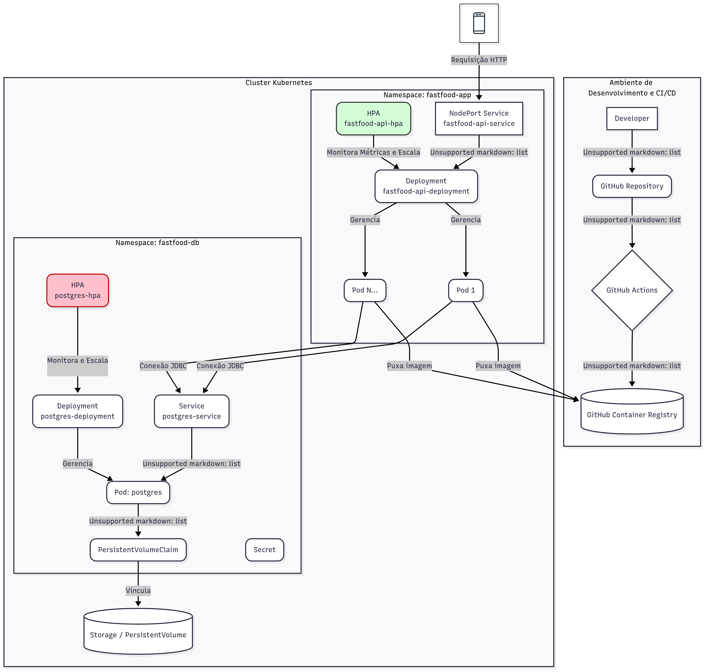

# Fast Food API

API para gerenciamento de pedidos de fast food, desenvolvida como parte do Tech Challenge da FIAP.

## Vídeo de Apresentação

[](https://youtu.be/brByCx_4ksk)

## Tecnologias Utilizadas

- Java 17
- Spring Boot 3.5.0
- Spring Data JPA
- PostgreSQL
- Docker
- Maven
- Swagger/OpenAPI

## Estrutura do Projeto

```
/src
 |__/main
    |__/java
       |__/com/postechfiap_group130/techchallenge_fastfood
          |__/domain 			# Nucleo: entidades, interfaces das portas, regras de negócio
          |  |__/model
          |  |__/ports
          |     |__/in  		# Interfaces de entrada (casos de uso)
          |     |__/out			# Interfaces de saída (repositórios, gateways)
          |
          |__/application 		# Mapeamento e orquestração de serviços
          |
          |__/adapters 			# Adapters (entrada e saída)
          |  |__/in			# Adapters de entrada (controllers)
          |  |__/out			# Adapters de saída (JpaRepositories, APIs externas)
          |
          |__/config 			# Beans, configurações, injeções de dependencias
```

## Funcionalidades

- Cadastro e gerenciamento de produtos
- Cadastro e gerenciamento de clientes
- Criação e acompanhamento de pedidos
- Checkout de pedidos

## Endpoints

### Produtos
- `GET /api/produtos/category/{category}` - Lista produtos por categoria
- `POST /api/produtos` - Cadastra novo produto
- `PUT /api/produtos` - Atualiza produto existente
- `DELETE /api/produtos` - Remove produto

### Pedidos
- `POST /orders/fake-checkout` - Realiza checkout de pedido
- `GET /orders` - Lista todos os pedidos

## Como Executar

1. Clone o repositório 
https://github.com/deferreira/soat-tech-challenge-fast-food
2. Execute o Docker Compose:
```bash
docker-compose up --build
```

3. Acesse a documentação Swagger:
- http://localhost:8080/swagger-ui.html
- http://localhost:8080/swagger-ui/index.html

## Status do Pedido

Os pedidos podem ter os seguintes status:
- RECEBIDO
- EM_PREPARACAO
- PRONTO
- FINALIZADO

<<<<<<< HEAD
<<<<<<< HEAD
Arquitetura Kubernetes

=======
=======

## Arquitetura Kubernetes


>>>>>>> 91d25a99974a7b27a08a32f5a1bcddf41d1ea9a2
## Arquitetura de negócio

1. Order
- Fluxo de Checkout (Criar Pedido)
Order

- Fluxo de Busca de Pedidos

- Fluxo de Busca de Pedidos por ID

- Fluxo de Atualização de Status de Pedido


2. Customer
-Fluxo de Criação de Cliente

- Fluxo de Consulta de Cliente por CPF

3. Product
- Fluxo de Consulta de Produto por Categoria

- Fluxo de Criação de Produto

- Fluxo de Atualização de Produto

4. Payment
- Fluxo de Consulta de Status de Pagamento

- Fluxo de Criação de Pagamento

- Recebe notificação e Atualiza Status de Pagamento e da Ordem
<<<<<<< HEAD
>>>>>>> 761daba0a69f2842ffba4b45c2c16497cb3b9a11
=======

>>>>>>> 91d25a99974a7b27a08a32f5a1bcddf41d1ea9a2
